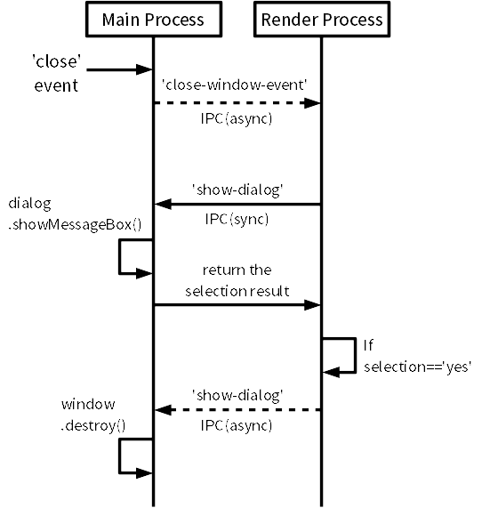

app11_preventclose
====
ウインドウを閉じようとしたときに、編集内容が未保存だったら
ダイアログを出す動作をどうやって実装するか？のメモ。

ウインドウを閉じるボタンを押した場合、デフォルトの動作は、

    ウインドウを閉じるボタンを押す
        ↓
    ウインドウ閉じる

だが、これを

    ウインドウを閉じるボタンを押す
        ↓
    「本当に閉じますか?」ダイアログを出す --(キャンセル)--> 何もしない
        ｜
      (はい)
        ↓
    ウインドウ閉じる

という動作に変更するために必要な実装について説明。

処理の概要
----

Render Process側
----

Main Process側からIPC(非同期)で'close-window-event'を受信したら、
closeWindow()を実行。

closeWindow()では、IPC同期呼び出しでRender Process側からダイアログを表示。
「はい」を選択した場合は、Main Process側にウインドウを閉じるように
'close-window'をIPC(非同期)で通知。

    var ipc = require('ipc');
    
    function closeWindow() {
        console.log(rv);
    
        // 閉じるかどうかを確認
        var rv = ipc.sendSync('show-dialog');
        console.log(rv);
    
        // yesを選択した場合はウインドウを閉じる
        if (rv == 0) {
            ipc.send('close-window');
        }
    }
    
    ipc.on('close-window-event', function(arg) {
        closeWindow();
    });

Main Process側
----
ポイント
* (1) RenderWindowの'close'イベントでevt.preventDefault()を呼び出す。これを呼び出すと、ウインドウの閉じるボタンを押してもウインドウが閉じなくなる。
* (2) 'close'イベント発生時にRender Process側へ'close-window-event'を通知。ウインドウを閉じるかどうかの判断はRender Process側で行うようにする。
* (3) Render Process側から'show-dialog'がIPC同期呼び出しされるので、ダイアログを表示し、選択結果をRender Process側へ返す。
* (4) ウインドウを閉じる場合はRender Process側から'close-window'がIPC(非同期)で通知される。通知されたタイミングで。RenderWindow.destroy()を呼び出し、実際にウインドウを閉じる動作を行う。

ウインドウ作成時…(1)(2)

    w.on('close', function(evt) {
      evt.preventDefault();
      w.webContents.send('close-window-event', 'testargs');
    }); 

'show-dialog'受信時…(3)

    ipc.on('show-dialog', function(evt, arg) {
      console.log("show-dialog");
    
      var webcontent = evt.sender;
      var w = hash.getWindow(webcontent);
    
      var rv = dialog.showMessageBox(w, {
          type: 'info',
          message: 'save changes?',
          buttons: ['Yes', 'No', 'Cancel']
      });
    
      evt.returnValue = rv;
    });

'close-window'受信時…(4)

    ipc.on('close-window', function(evt, arg) {
      var webcontent = evt.sender;
      var w = hash.getWindow(webcontent);
    
      w.destroy();
      hash.delete(webcontent);
    });

JavaScriptの連想配列で困ったこと…
----
Main Process側のipcの引数evtには、evt.senderにIPCの呼び出し元であるWebContentsオブジェクトが格納されていて、
どのコンテンツからIPCの呼び出しが行われたかを知ることができる。
しかし、今回の実装ではIPCで呼び出されたときに、RenderWindowに対する操作を行いたい。
そこで、WebContentsがどのRenderWindowに割り当てられているかを知る必要がある。

そこで、RenderWindow作成時にRenderWindowとRenderWindow.webContentsの内容を連想配列として
保存しておき、IPCで呼び出された際に、WebContentsからRenderWindowのインスタンスを取得する…

…という実装にしようと思ったが、実はJavaScriptの連想配列のキーは数値・文字列は使えるが
オブジェクトは使えない罠がある。

そこで今回の実装では、独自にWebContentHashを作成し、WebContentsのインスタンスから
割り当てられているRenderWindowのインスタンスを取得できるように実装している。

    var hash = new WebContentHash();
    
    function WebContentHash() {
      this.webcontents = [];
      this.windows     = [];
    }
    
    WebContentHash.prototype.push = function(webcontent, window) {
      this.webcontents.push(webcontent);
      this.windows.push(window);
    }
    
    WebContentHash.prototype.getWindow = function(webcontent) {
      var idx = this.webcontents.indexOf(webcontent);
      if (idx < 0) return null;
      return this.windows[idx];
    }
    
    WebContentHash.prototype.delete = function(webcontent) {
      var idx = this.webcontents.indexOf(webcontent);
      if (idx < 0) return;
    
      this.webcontents.splice(idx, 1);
      this.windows.splice(idx, 1);
    }
